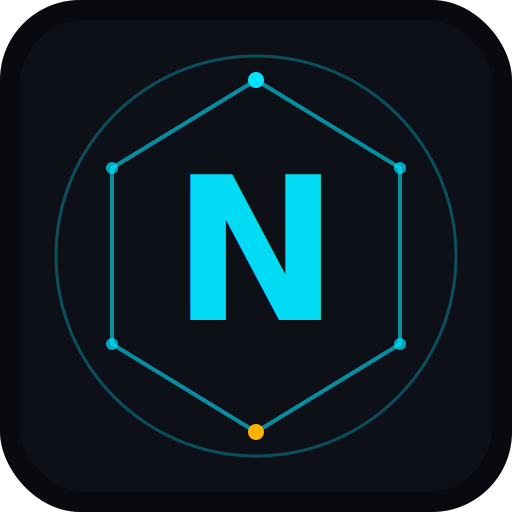

# ⚡ NEXUS Quest Manager

Ein gamifizierter Produktivitäts-RPG mit XP, Skill Tree, Karten, Achievements und Lootboxen.



## 🚀 Live-Demo auf GitHub Pages

### Schritt-für-Schritt Deploy (5 Minuten)

**1. Repository erstellen**
```
GitHub.com → New Repository
Name: nexus-quest-manager
Visibility: Public   ← Wichtig für kostenloses Pages!
```

**2. Dateien hochladen**

Option A — GitHub Web UI (einfachste Methode):
```
Im Repository → "Add file" → "Upload files"
Alle Dateien und Ordner aus dem ZIP hierher ziehen
Commit: "Initial release"
```

Option B — Git (falls installiert):
```bash
git clone https://github.com/DEIN-USERNAME/nexus-quest-manager
# Alle Dateien in den Ordner kopieren
cd nexus-quest-manager
git add .
git commit -m "Initial release"
git push
```

**3. GitHub Pages aktivieren**
```
Repository → Settings → Pages
Source: "GitHub Actions"
→ Der Workflow deployt automatisch!
```

**4. Fertig!**
```
URL: https://DEIN-USERNAME.github.io/nexus-quest-manager/
```

---

## 📱 Als App installieren (PWA)

Sobald die App läuft, kannst du sie als App installieren:

| Platform | Methode |
|---|---|
| **Android** | Chrome → Menü (⋮) → „App installieren" |
| **iPhone/iPad** | Safari → Teilen (□↑) → „Zum Home-Bildschirm" |
| **Windows/Mac** | Chrome/Edge → Adressleiste → Installations-Icon |

Die App läuft dann **offline**, sieht wie eine native App aus, und hat kein Browser-Chrome.

---

## 🗂️ Dateistruktur

```
nexus/
├── index.html          ← Haupt-App
├── manifest.json       ← PWA-Konfiguration
├── sw.js               ← Service Worker (Offline)
├── assets/             ← Icons
│   ├── icon-192.png
│   ├── icon-512.png
│   ├── icon-maskable.png
│   └── apple-touch-icon.png
├── css/
│   ├── variables.css   ← Design-Tokens
│   ├── base.css        ← Reset
│   ├── components.css  ← UI-Komponenten
│   ├── layout.css      ← App-Shell
│   └── animations.css  ← Animationen
├── js/
│   ├── config.js       ← Spielkonfiguration
│   ├── state.js        ← Spielstand + localStorage
│   ├── engine.js       ← XP, Level, Streak
│   ├── cards.js        ← Karten + Lootboxen
│   ├── achievements.js ← Achievement-System
│   ├── cosmetics.js    ← Themes + Cosmetics
│   ├── skilltree.js    ← Skill Tree System
│   ├── render.js       ← UI-Rendering
│   ├── profile.js      ← Profil-Features
│   └── app.js          ← Haupt-Controller
└── .github/
    └── workflows/
        └── pages.yml   ← Auto-Deploy
```

---

## ⚙️ Features

- **Skill Tree** — 34 Skills in 6 Kategorien, Tier-basiert, dynamisches Effekt-System
- **Grid Inventory** — 6×4 Slots, Stacking, Last-Used Quick Slot
- **Lootbox System** — 5 Raritäten (Common → Mythic), Pity-Garantien
- **Daily 7-Day Login** — 7-Tage Belohnungs-Zyklus
- **Weekly Challenges** — Multi-Step mit Fortschrittsbalken
- **Task Schwierigkeiten** — Mikro/Normal/Schwer mit unterschiedlichen XP
- **Offline-Support** — Service Worker cacht alle Assets

---

## 🛠️ Lokales Testen

```bash
# Mit Python (überall verfügbar)
python3 -m http.server 8080
# → http://localhost:8080

# Mit Node.js
npx serve .
# → http://localhost:3000
```

> **Wichtig:** Direkt als `file://` öffnen funktioniert NICHT (CORS).
> Immer einen lokalen Server verwenden!
